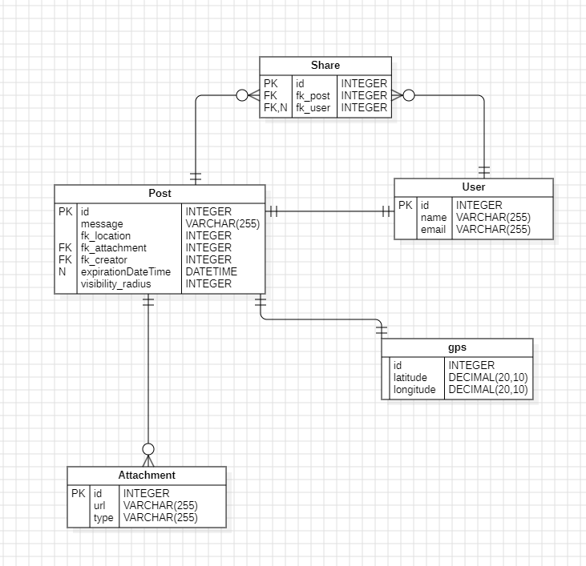
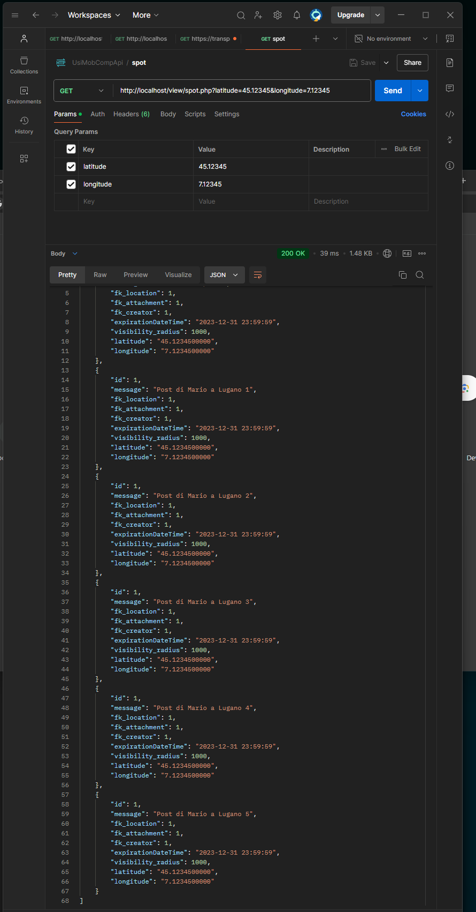

### Documentation for usi_mob_comp_project

This project is a mobile computing project for the course of Mobile Computing at USI, Lugano. 

The project is about developing a mobile application that can be used to track the user's location encrypt a message based on a gps location and send it to another user. 

The other user can then decrypt the message using location.

The project is developed using Android Studio and the programming language used is Java.

---
### Required Software:
- Android Studio: https://developer.android.com/studio
- Doker desktop: https://www.docker.com/products/docker-desktop
- starUML: https://staruml.io/download
    - to correct funtionality remembar to install DDL creation Extension: 
        - go to Tools > Extension Manager install from url.
        - [copy this link andinstall it this](https://github.com/niklauslee/staruml-ddl/archive/refs/heads/master.zip).

- postMan : https://www.postman.com/downloads/

--- 
### Installation:

co into root directory of the project where is placed doker compose file and run the following command :
     docker-compose up --build

this command will start the bakend and the database on local machine.

the structure of thedatabaise is contained in UML.mdj [link]  file that can be opened with starUML.

---

### Diagrams:

project structure diagram:

- !TODO: add diagram

database diagram:

### Example API calls:

## Todo:

- Bakand Api documentation visibel [here](https://editor.swagger.io/)
    - not working

